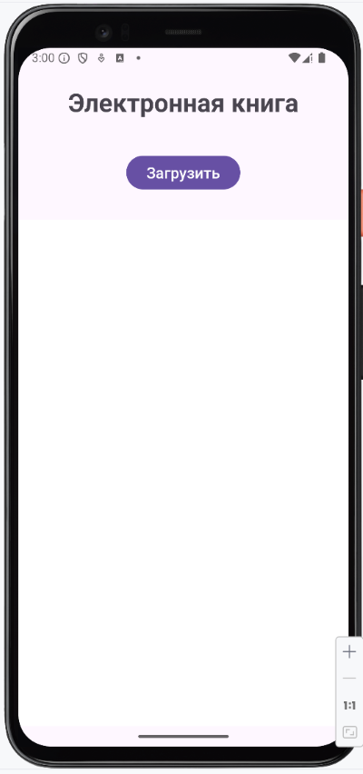
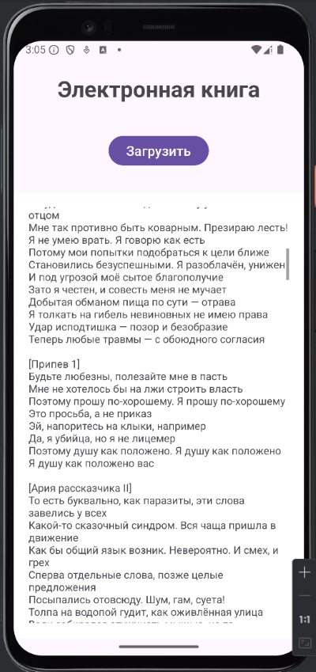
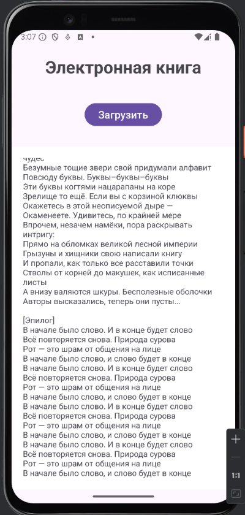

# Домашнее задание по теме "RelativeLayout ToggleButton ScrollView"

### Приложение «Электронная книга»
1. На экране приложения необходимо создать заголовок **«Электронная книга»**.
2. Необходимо создать кнопку **«Загрузить»** для загрузки электронной книги базы данных.
3. В качестве базы данных необходимо создать класс `database.kt`, в котором будет находиться в переменной `text` небольшой художественный рассказ.
4. В классе `MainActivity` при нажатии кнопки загрузки книга загружается из базы данных. Для этого нужно написать функцию `loadBook(text: String): List<String>`, она возвращает список отдельно взятых слов этой книги.
5. В текстовое поле вывода под кнопкой мы получаем текст книги в результате работы с полученным списком. Т.к. весь текст, вероятно, не поместится в размеры экрана, необходимо чтобы он скролился.

Приложение необходимо сохранить проектом в удаленном репозитории, для проверки качества предоставить ссылку преподавателю, либо сделать скрин эмулятора при загруженной книге на экран. Необходимо сделать несколько скринов для визуализации процесса скролла экрана.

### Скриншоты домашнего задания

Скриншоты смотреть здесь

